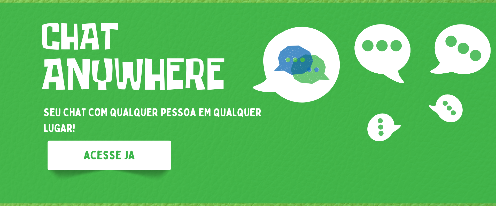

<a href="https://github.com/filipeleonelbatista/delivery-generic/blob/master/readme.md" target="_blank">
  
  Version in Brasilian Portuguese
</a>
</br>
</br>



# Index

- [About](#-about)
- [Technologies](#technologies)
- [Installation](#installation)

## 🔖&nbsp; About

Application where you create a room using the URL link and can send the link to friends. You and your friends just need to select a name and an avatar and both of you can be in the same room.

The idea is to be a place for exchanging text in real time, without saving data, just keeping the record in the application's memory.

[Link to the project running on the WEB](https://chat-anywhere-two.vercel.app/) 

You can create your room by adding `/room_name` next to the final bar of the address. Or `?room=My Room Here` and it will open as well.

## Objective

Connect people quickly and without registrations. I used this project to test the use of websockets in a react client application, I learned a lot about deploying the application in AWS, GCP, DO, Vercel and VPS environments and their particularities in relation to the use of websockets in each situation.

### Main features

- List of online users
- Notification if they are in the room or have left
- Identification of user or guest messages
- Creation of rooms by links and by the application
- Server monitoring, displaying alerts if offline.

#### Considerations

I created this application using Next JS, on my machine and on the VPS it worked, but in some cases, such as the Vercel and free GCP plans, they do not accept the use of WS for some reason.

So I returned only to React Vite with the Server running on Node, I uploaded the frontend on Vercel and the Server on Render. Occasionally, Render goes offline, but from what I understand it returns, so when trying to access it again it is possible that the service returns. The next step would be to use a VPS or expose a local environment using Cloudflare or similar.

---
## Technologies

This project was developed with the following main technologies:

- [Typescript](https://www.typescriptlang.org/)
- [React JS](https://legacy.reactjs.org/docs/getting-started.html)
- [Socket IO](https://socket.io/)
- [Node JS](https://facebook.github.io/react-native/)
- [Tailwind](https://tailwindcss.com/)

and more...

---
## Installation

The project runs with [Node.js](https://nodejs.org/) v20+.

Instructions to install the dependencies and start the project.

### Web 

```sh 
cd chat-anywhere/front 
npm i 
npx run dev 
``` 

### Server 

```sh 
cd chat-anywhere/server 
npm i 
npx run dev
```

---

<h3 align="center">Let's connect 😉</h3>
<p align="center">
  <a href="https://www.linkedin.com/in/filipeleonelbatista/">
    
  </a>&ensp;
  <a href="mailto:filipe.x2016@gmail.com">
    
  </a>&ensp;
  <a href="https://instagram.com/filipeleonelbatista">
    
  </a>
</p>